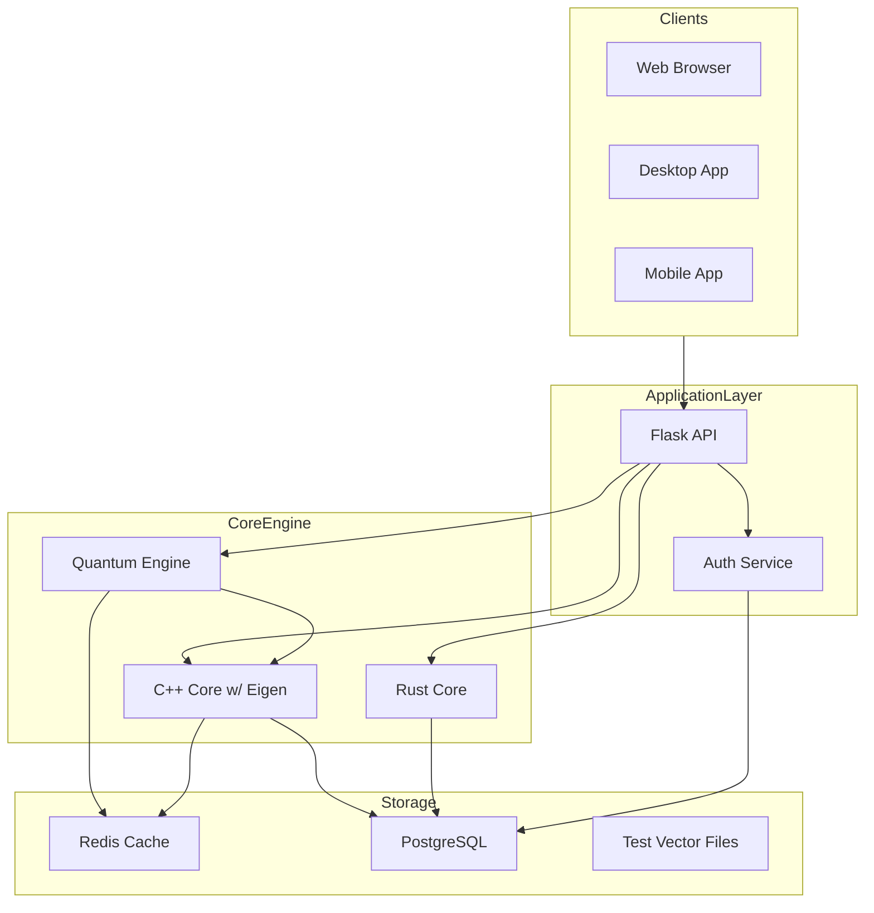
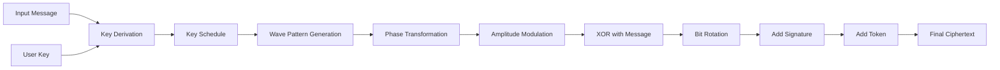
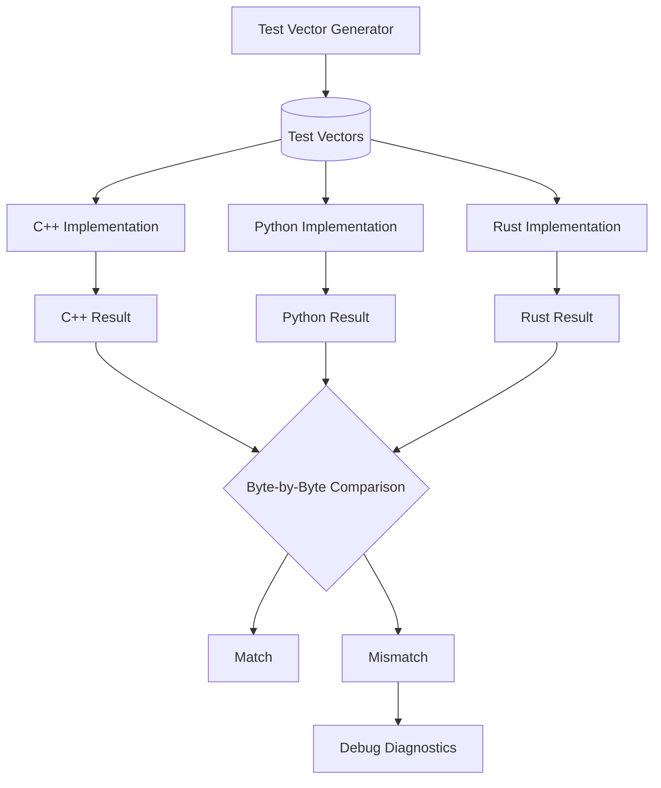
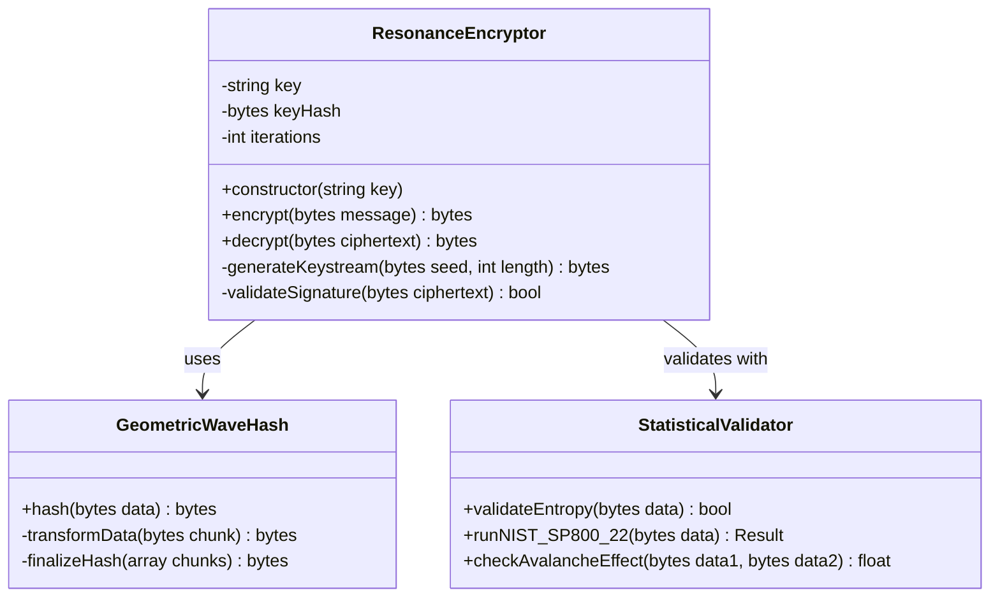

# QuantoniumOS Architecture & Flow Diagrams

This document provides visual representations of QuantoniumOS's key components and data flows.

## System Architecture



## Encryption Pipeline



## Cross-Implementation Validation Flow



## Resonance Encryption Class Structure



## CI/CD Pipeline

```mermaid
flowchart TD
    Push[Git Push] --> MainCI{Green Wall CI}
    MainCI --> PythonTests[Python Core Validation]
    MainCI --> CPPBuildLinux[C++ Build (Linux)]
    MainCI --> CPPBuildWin[C++ Build (Windows)]
    MainCI --> IntegrationTests[Integration Tests]
    MainCI --> GenerateArtifacts[Generate Artifacts]

    GenerateArtifacts --> TestVectors[(Test Vectors)]
    GenerateArtifacts --> Benchmarks[(Benchmarks)]

    TestVectors --> CrossValidation{Cross-Validation CI}
    CrossValidation --> ValStatus[Validation Status]

    PythonTests --> GreenWallStatus{Green Wall Status}
    CPPBuildLinux --> GreenWallStatus
    CPPBuildWin --> GreenWallStatus
    IntegrationTests --> GreenWallStatus
    ValStatus --> GreenWallStatus

    GreenWallStatus --> Success[Success ]
    GreenWallStatus --> Failure[Failure ]
```
