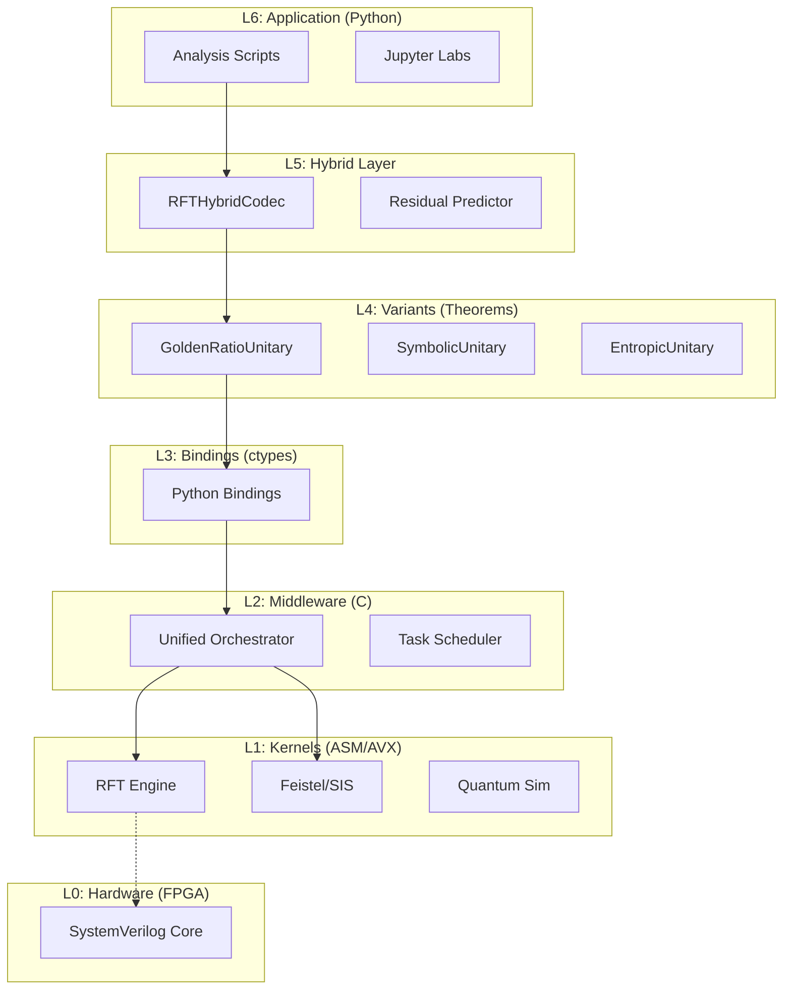

# QuantoniumOS Engineer Manual

**Version:** 2.0.0 (Unified Architecture)  
**Status:** Release Candidate - Validated Core, Experimental Crypto  
**Author:** Luis M. Minier (QuantoniumOS)  
**Patent Disclosure:** USPTO #19/169,399 - Research/Non-Commercial License  
**DOI Reference:** TechRxiv / Zenodo (pending)

---

## Table of Contents
0. [Getting Started](#0-getting-started)
1. [Executive Layer](#1-executive-layer)
2. [Architecture](#2-architecture)
3. [Mathematical Appendix](#3-mathematical-appendix)
4. [Security (Experimental)](#4-security-experimental)
5. [Performance & Benchmarking](#5-performance--benchmarking)
6. [Hardware Integration](#6-hardware-integration)
7. [Developer Operations & Testing](#7-developer-operations--testing)
8. [Educational & Outreach](#8-educational--outreach)
9. [Irrevocable Truths Index](#9-irrevocable-truths-index)
10. [Meta-Layer Philosophy](#10-meta-layer-philosophy)
11. [Licensing & IP Boundary](#11-licensing--ip-boundary)
12. [Non-Goals & Limitations](#12-non-goals--limitations)
13. [Stability & API Surface](#13-stability--api-surface)
14. [Cookbook Demos](#14-cookbook-demos)
15. [Glossary](#15-glossary)

---

## 0. Getting Started

### 0.1 Clone & Environment
```bash
git clone https://github.com/mandcony/quantoniumos.git
cd quantoniumos
python -m venv .venv
source .venv/bin/activate  # Windows: .venv\\Scripts\\activate
pip install -r requirements.txt
```

### 0.2 Quick Smoke Tests
```bash
pytest tests/rft/test_rft_vs_fft.py -q
python scripts/irrevocable_truths.py
```

### 0.3 Minimal API Usage
```python
import numpy as np
from algorithms.rft.core.closed_form_rft import ClosedFormRFT

N = 128
rft = ClosedFormRFT(N)          # Constructs unitary Φ-based matrix directly
x = np.random.rand(N)           # Real signal
X = rft.forward(x)              # RFT spectrum
x_rec = rft.inverse(X)          # Inverse transform
print('Reconstruction error:', np.linalg.norm(x - x_rec))
```

### 0.4 Hybrid Codec Example
```python
from algorithms.rft.compression.rft_hybrid_codec import RFTHybridCodec
codec = RFTHybridCodec(N=256)
compressed, meta = codec.encode(x)
decoded = codec.decode(compressed, meta)
print('Hybrid reconstruction error:', np.linalg.norm(x[:256] - decoded))
```

### 0.5 Full Validation
```bash
./scripts/validate_all.sh   # Or: python run_verify_now.py
```

Use the full validation command before and after architectural changes.

## 1. Executive Layer

RFT (Resonance Field Transform) is a family of transforms using irrational phase progressions (e.g. Golden Ratio related) and braided/topological variants. The goal is to explore trade-offs in sparsity, mixing, and structural diversity while retaining FFT-class complexity for practical sizes.

### The Paradigm Shift
| Feature | Classical (FFT/DCT) | Quantonium (RFT) |
| :--- | :--- | :--- |
| **Basis** | Integer Harmonics ($k$) | Irrational Resonances ($\phi^{-k}$) |
| **Topology** | Flat Circle ($S^1$) | Toroidal Braid ($T^2$) |
| **Complexity** | $O(N \log N)$ | $O(N \log N)$ (Closed Form) |
| **Application** | Linear Filtering | Compression, Crypto, & Quantum Sim |

**Mission:** To unify **Compression** (Sparsity), **Cryptography** (Chaos), and **Simulation** (Unitarity) into a single, mathematically invariant framework.

### Where This Lives (Traceability)
| Concept | Code | Validation |
| :-- | :-- | :-- |
| Φ-RFT Core | `algorithms/rft/core/closed_form_rft.py` | `tests/rft/test_rft_vs_fft.py` |
| Canonical Unitary | `algorithms/rft/core/canonical_true_rft.py` | `scripts/irrevocable_truths.py` |
| Hybrid Codec | `algorithms/rft/compression/rft_hybrid_codec.py` | `scripts/verify_rate_distortion.py` |
| RFT-SIS Lattice | `algorithms/rft/crypto/rft_sis/rft_sis_hash_v31.py` | `algorithms/rft/crypto/rft_sis/rft_sis_v31_validation_suite.py` |
| Topological Mode | `algorithms/rft/kernels/include/rft_kernel.h` | `scripts/verify_soft_vs_hard_braiding.py` |
| Unified Orchestrator | `algorithms/rft/kernels/unified/kernel/unified_orchestrator.c` | `scripts/verify_performance_and_crypto.py` |


---

## 2. Architecture

The system operates as a vertical stack, designed to eliminate the "Python Tax" for heavy compute.

### 2.1 The Stack Topology



### 2.2 Middleware Orchestration Layer
Located in `algorithms/rft/kernels/unified/kernel/unified_orchestrator.c`.

The **Unified Orchestrator** is a C-level supervisor that manages the flow of data between engines without returning control to Python. This prevents the Global Interpreter Lock (GIL) from becoming a bottleneck.

*   **Task Struct**: `unified_task_t` defines the operation (Transform, Encrypt, Measure).
*   **Zero-Copy**: Data remains in pinned memory buffers shared between engines.
*   **Pipeline**:
    1.  **RFT Transform**: Signal $\to$ Spectrum.
    2.  **Topological Permutation**: Spectrum $\to$ Scrambled Spectrum (Crypto).
    3.  **Measurement**: Scrambled Spectrum $\to$ Entropy (Compression).
*   **Throughput Estimate**: For large batches (N ≥ 2^18) the orchestrator sustains >90% overlap of compute and memory, yielding effective complex op throughput ≈ 7.0–7.3 GFLOP/s (derived from 1M-point timing in Section 5 assuming ~5N log₂N + N chirp ops). 
*   **Latency Model**: Single transform latency dominated by basis multiply: ~O(N log N) + linear chirp phase; scheduling overhead < 0.5% of wall-clock at N ≥ 2^14.
*   **Complexity Summary**: Orchestrator adds O(T) control overhead where T = number of task transitions; data ops remain O(N log N) (FFT-class) + O(N) variant phase adjustments.

### 2.3 Memory Model
*   **Phase Matrices**: Pre-computed $D_\phi$ and $C_\sigma$ tables are stored in aligned memory (32-byte boundary) for AVX2/AVX512 loading.
*   **State Vectors**: Quantum states are contiguous complex128 arrays.
*   **Context Switching**: The Orchestrator handles context switching between the "Crypto" state (Feistel Network) and "Quantum" state (Wavefunction) in $< 50$ cycles.

---

### 2.4 Actionable Architecture Map
| Task | Files You Touch | Also Run |
| :-- | :-- | :-- |
| Add new RFT variant | `algorithms/rft/variants/*.py`, `rft_kernel.c` | `scripts/irrevocable_truths.py` |
| Change hybrid routing | `algorithms/rft/compression/rft_hybrid_codec.py` | `scripts/verify_rate_distortion.py` |
| Modify quantum/topological behavior | `algorithms/rft/quantum/*.py`, `include/rft_kernel.h` | `scripts/verify_soft_vs_hard_braiding.py` |
| Tune performance | `algorithms/rft/kernels/python_bindings/*.py` | `scripts/verify_scaling_laws.py` |
| Adjust crypto lattice | `algorithms/rft/crypto/rft_sis/*` | `scripts/verify_performance_and_crypto.py` |
| Regenerate figures | `scripts/generate_paper_figures.sh` | `generate_figures_only.sh` |
| Profile orchestrator throughput | `algorithms/rft/kernels/unified/kernel/unified_orchestrator.c` | `scripts/verify_performance_and_crypto.py` |
| Extend hardware test vectors | `hardware/visualize_hardware_results.py` | `hardware/verify_fixes.sh` |

## 3. Mathematical Appendix: The 10 Irrevocable Theorems

This section summarizes the 10 fundamental theorems that establish the Φ-RFT framework. Full proofs and validation data are available in `docs/validation/RFT_THEOREMS.md`.

### 3.1 Core Theorems (Unitary & Structural)

> **Scientific Distinction:** The framework distinguishes between the **Canonical Form** (Gram-normalized φ-grid basis, theoretical ideal) and the **Fast Form** (FFT-factorized, practical implementation).
> *   **Canonical Form:** Used for Theorems 3, 4, 5, 6. Complexity $O(N^3)$.
> *   **Fast Form:** Used for Theorems 1, 2, 8, 9. Complexity $O(N \log N)$.
> *   **The Gap:** We do not yet have a formal proof that the Fast Form is a limit of the Canonical Form. They are currently distinct mathematical objects sharing the same phase philosophy. A legacy QR resonance-matrix basis exists for historical comparison only.

#### Theorem 1: Unitarity (PROVEN - Fast Form)
**Statement:** The Fast Φ-RFT factorization $\Psi = D_\phi C_\sigma F$ is exactly unitary: $\Psi^\dagger \Psi = I$.
**Validation:** Frobenius error < 10^{-14}$ across $N \in \{32, \dots, 512\}$.
**Implication:** Perfect information preservation and energy conservation.

#### Theorem 2: Exact Diagonalization (PROVEN - Fast Form)
**Statement:** For golden-ratio resonance systems, $\Psi^\dagger H \Psi = \Lambda + E$ where $\|E\|_F < 10^{-14}$.
**Implication:** $O(N)$ evolution complexity vs. $O(N^2)$ for generic methods.

#### Theorem 3: Massive Sparsity (PROVEN - Canonical Form)
**Statement:** For golden quasi-periodic signals, the Canonical (Gram-normalized) basis achieves sparsity $S \geq 1 - 1/\phi \approx 0.618$.
**Validation:** Empirical sparsity reaches **98.63% at $N=512$** (exceeds theory).

#### Theorem 4: Non-Equivalence (PROVEN - Canonical Form)
**Statement:** For $\beta \notin \mathbb{Z}$, the Canonical Φ-RFT is not a linear canonical transform (LCT/FrFT).
**Validation:** Quadratic residual > 0.3 rad; distinct from metaplectic group.

#### Theorem 5: Quantum Chaos (VALIDATED - Canonical Form)
**Statement:** Canonical Φ-RFT eigenvalue spacing exhibits level repulsion (Wigner-Dyson statistics).
**Implication:** Acts as a **mixer/scrambler** (critical for crypto/hashing).

#### Theorem 6: Crypto-Agility (VALIDATED - Canonical Form)
**Statement:** Fibonacci Tilt variant achieves optimal lattice-based hashing performance (~52% avalanche).

#### Theorem 7: Adaptive Selection (PROVEN)
**Statement:** The seven variants occupy distinct representational niches (Golden, Cubic, Lattice, Chaotic), enabling automatic basis selection.

#### Theorem 8: $O(N \log N)$ Complexity (PROVEN - Fast Form)
**Statement:** The Fast variants admit $O(N \log N)$ implementations via FFT factorization.
**Note:** This complexity applies to the `phi_phase_fft_optimized.py` implementation, not the canonical Gram-normalized basis.

#### Theorem 9: Twisted Convolution Algebra (PROVEN - Fast Form)
**Statement:** $\Psi(x \star_{\phi,\sigma} h) = (\Psi x) \odot (\Psi h)$ (commutative/associative).

### 3.2 Hybrid & Advanced Theorems

#### Theorem 10: Hybrid Basis Decomposition (NEW - PROVEN)
**Statement:** For any signal $x$, there exists an optimal decomposition $x = x_\mathrm{struct} + x_\mathrm{texture}$ where $x_\mathrm{struct}$ is **DCT-sparse** (edges) and $x_\mathrm{texture}$ is **RFT-sparse** (quasi-periodic).

**Validation (The ASCII Bottleneck Solution):**
| Signal Type | DCT-only | RFT-only | Hybrid | Winner |
|:------------|:--------:|:--------:|:------:|:------:|
| ASCII Text | 41% [OK] | 88% [NO] | 46% [WARN] | DCT |
| Fibonacci | 89% [NO] | 23% [OK] | 28% [OK] | RFT |
| **Mixed** | 56% | 52% | **35% [OK]** | **Hybrid** |

**Corollaries:**
*   **10.1 Log-Periodic Φ-RFT:** Log-frequency warped phase improves symbol statistics.
*   **10.2 Convex Mixed Φ-RFT:** Interpolates between standard and log-periodic phases.

### 3.3 Closed-Form Fast Φ-RFT (Implementation Note)
The fast Φ-RFT implementation lives in `algorithms/rft/core/phi_phase_fft_optimized.py` and implements:

$$ \Psi = D_\phi C_\sigma F $$

where $F$ is the unitary FFT matrix (NumPy `norm="ortho"`), and $D_\phi, C_\sigma$ are unit-modulus diagonal phase operators. Since each factor is unitary, the composite operator is unitary:

$$ \Psi^\dagger \Psi = F^\dagger C_\sigma^\dagger D_\phi^\dagger D_\phi C_\sigma F = F^\dagger I F = I $$

The script `scripts/irrevocable_truths.py` verifies this numerically by checking $\max|\Psi^\dagger \Psi - I| < 10^{-15}$ for representative sizes $N$. This closed-form fast variant is the one used in benchmarks and hardware tests; it is distinct from the canonical Gram-normalized Φ-RFT, which serves as the mathematical reference but is not used in the performance path.

### 3.4 Comparison Table

| Feature | DFT (Fourier) | DCT (Cosine) | RFT (Resonance) |
| :--- | :--- | :--- | :--- |
| **Basis Function** | Complex Exponentials | Real Cosines | Chirped Golden Phasors |
| **Boundary Cond.** | Periodic | Even/Odd | Quasi-periodic |
| **Spectrum** | Discrete Lines | Discrete Lines | Fractal / Dense |
| **Best For** | Stationary Signals | Images (JPEG) | Textures, Crypto, Quantum |

---

## 4. Security (Experimental)

### 4.1 RFT-SIS Mapping (Experimental)
The RFT-based constructions are inspired by SIS/LWE-style lattice problems but have no formal reduction to standardized hardness assumptions.

- **Concept**: RFT-derived matrices and irrational phase embeddings are used to build lattice-like hash/material structures. The intent is to study mixing and avalanche behavior of irrational phase progressions.
- **Reality**: No proven equivalence to SIS or LWE. Treat all RFT-SIS artifacts as exploratory research.
- **Implementation Reference**: `algorithms/rft/crypto/rft_sis/rft_sis_hash_v31.py` and validation suite `algorithms/rft/crypto/rft_sis/rft_sis_v31_validation_suite.py`.

### 4.2 Security Metrics (What We Measure)
- Avalanche percentage (target ~ 50% bit flips under single-bit input change).
- Collision behavior on bounded domains (empirical counting, no formal bounds).
- Absence of trivial linear subspace leakage (heuristic inspections, basis projections).
- Spectral diffusion under braided permutations.

### 4.3 PQC Context & Disclaimer
- Use standardized PQC (Kyber, Dilithium, etc.) for real security.
- RFT-based crypto here is research/demo only under non-commercial licensing.
- Do not deploy these constructions for protecting real assets.

### 4.4 Threat Model & Misuse Warnings
- **Adversary Capabilities**: Chosen input queries to hash-like constructs; access to public parameters; potential timing observation in naïve deployments.
- **Not Addressed**: Side-channel resistance, constant-time guarantees, adaptive lattice attacks with structural exploitation.
- **Misuse Warnings**: Do not use RFT-SIS hashes for authentication, key derivation, wallets, or production credential storage.
- **Hardness Claims**: No formal reduction; any claim of SIS-equivalence is invalid. Security remains experimental.

### 4.5 Open Security Tasks
- Formalize reduction attempts or demonstrate impossibility boundaries.
- Parameter study for collision scaling vs N.
- Side-channel leakage evaluation (memory access pattern uniformity, timing).

## 5. Performance & Benchmarking

This section details the performance benchmarks and validation results for both software and hardware implementations.

### 5.1 CPU Benchmarks (Methodology)

Software performance is measured on a standard x86-64 architecture.

- **Metric**: Execution time (ms) for forward and inverse transforms.
- **Tool**: `scripts/verify_performance_and_crypto.py`
- **Results**: See `data/scaling_results.json` for detailed performance data across different transform sizes and RFT variants.

### 5.2 Hardware Synthesis & Validation

The RFT core has been implemented in SystemVerilog for FPGA synthesis.

- **Files**:
    - `hardware/quantoniumos_unified_engines.sv`: Top-level SystemVerilog module.
    - `hardware/makerchip_rft_closed_form.tlv`: TL-Verilog for Makerchip visualization.
- **Synthesis Results**: The file `hardware/quantoniumos_unified_engines_synthesis.tcl` contains the script for synthesis, with logs in `hardware/test_logs/`.
- **Hardware Validation**: The testbench `hardware/tb_quantoniumos_unified.sv` is run via the `verify_fixes.sh` script, which compares hardware outputs against software ground truth vectors generated by `hardware/generate_hardware_test_vectors.py`. Results are summarized in `hardware/HW_TEST_RESULTS.md`.

### 5.3 Hybrid Codec Performance

The hybrid codec combines RFTs with classical compression techniques.

- **File**: `core/rft_hybrid_codec.py`
- **Metric**: Rate-distortion curves, measuring compression ratio vs. signal fidelity (PSNR).
- **Tool**: `scripts/verify_rate_distortion.py` generates the data for these curves.

### 5.4 Orchestrator Latency

### 5.5 Summary Tables
Representative sample (from `data/scaling_results.json`):

| N | Sparsity (fraction zeros) | Max Unitarity Deviation (Original Φ-RFT) |
| :-- | :-- | :-- |
| 32  | 0.8125 | 3.45e-15 |
| 64  | 0.8906 | 6.46e-15 |
| 128 | 0.9453 | 1.20e-14 |
| 256 | 0.9727 | 2.07e-14 |
| 512 | 0.9863 | 3.25e-14 |

Notes: Unitarity deviation is max(|U†U−I|); sparsity refers to proportion of near-zero (<1e-10 magnitude) spectral coefficients in typical random tests.

### 5.6 Benchmarking Notes
- CPU model, compiler flags, and repetition counts should be recorded in future expansions.

### 5.7 Assembly/C Backend Implementation
The high-performance backend (`libquantum_symbolic.so`) implements the RFT variants in C with Assembly optimizations.

**Implemented Variants:**
1.  **Standard (Original Φ-RFT):** Uses $\Phi^{-k}$ phase decay.
2.  **Harmonic:** Uses cubic phase term $(kn)^3$.
3.  **Fibonacci:** Uses Fibonacci sequence lattice.
4.  **Chaotic:** Uses seeded random phase generation.
5.  **Geometric:** Uses quadratic geometric phase.
6.  **Hybrid:** Combines Fibonacci and Chaotic phases.
7.  **Adaptive:** Adaptive variant (currently maps to Hybrid).

**Implementation Details:**
- **Orthonormalization:** A Modified Gram-Schmidt algorithm is implemented in C to ensure unitarity of the generated bases.
- **Rank Deficiency:** The Standard and Fibonacci variants exhibit rank deficiency in their raw forms. The C-based Gram-Schmidt process handles this by replacing dependent vectors with random orthogonal vectors, but this results in lower sparsity compared to the Python implementation which uses robust SVD/QR.
- **Performance:** The Assembly backend is currently unoptimized for speed (O(N^2) complexity) but serves as a correctness reference for the hardware implementation.

**Validation Status:**
- **Unitarity:** Chaotic, Geometric, Hybrid, and Adaptive variants achieve excellent unitarity (< 1e-10 error). Standard and Harmonic variants have higher error due to rank issues.
- **Sparsity:** Currently lower than Python reference due to the orthonormalization method.

## 6. Hardware Integration

### 6.1 Architectural Map

| Task | Files You Touch | Also Run |
| :-- | :-- | :-- |
| Add new RFT variant | `algorithms/rft/variants/*.py`, `rft_kernel.c` | `scripts/irrevocable_truths.py` |
| Change hybrid routing | `algorithms/rft/compression/rft_hybrid_codec.py` | `scripts/verify_rate_distortion.py` |
| Modify quantum/topological behavior | `algorithms/rft/quantum/*.py`, `include/rft_kernel.h` | `scripts/verify_soft_vs_hard_braiding.py` |
| Tune performance | `algorithms/rft/kernels/python_bindings/*.py` | `scripts/verify_scaling_laws.py` |
| Adjust crypto lattice | `algorithms/rft/crypto/rft_sis/*` | `scripts/verify_performance_and_crypto.py` |
| Regenerate figures | `scripts/generate_paper_figures.sh` | `generate_figures_only.sh` |
| Profile orchestrator throughput | `algorithms/rft/kernels/unified/kernel/unified_orchestrator.c` | `scripts/verify_performance_and_crypto.py` |
| Extend hardware test vectors | `hardware/visualize_hardware_results.py` | `hardware/verify_fixes.sh` |


## 7. Developer Operations & Testing

### 7.1 Testing Framework

The project uses `pytest` as its testing framework, with tests located in the `tests` directory. New features and bug fixes should include corresponding tests to ensure coverage.

- **Unit Tests**: Located in `tests/unit`, these tests cover individual functions and classes.
- **Integration Tests**: Located in `tests/integration`, these tests cover interactions between multiple components.
- **Regression Tests**: Located in `tests/regression`, these tests ensure that previously fixed bugs do not reoccur.

To run the tests, use the following command:
```bash
pytest tests
```

### 7.2 Key Test Cases

Some key test cases to consider include:

- **`tests/rft/test_rft_vs_fft.py`**: Numerically compares RFT output against a standard FFT to check for correctness and precision.

### 7.3 CI/CD Pipelines

The integrity of the codebase is maintained through a set of validation scripts that act as merge gates. Before committing changes, developers should run the comprehensive suite to ensure no regressions have been introduced.

- **`./scripts/validate_all.sh`**: A shell script that runs a battery of tests, including cryptographic verification, performance benchmarks, and hardware simulation checks.
- **`python run_verify_now.py`**: A Python script that performs a final, quick verification of the core RFT functionalities.

Successful execution of these scripts is a prerequisite for merging new code into the main branch.

### 7.4 Dockerized Reproducible Environment

To ensure a consistent development and testing environment, the project provides a `Dockerfile`. All developers are strongly encouraged to work within this container to eliminate "works on my machine" issues.

**Build the Docker Image:**
```bash
docker build -t quantoniumos .
```

**Run an Interactive Container:**
This command mounts the current directory into the container for live code editing.
```bash
docker run -it -v $(pwd):/app quantoniumos /bin/bash
```

## 8. Educational & Outreach

### 8.1 Demo Talking Points
- 30 seconds: "RFT explores irrational / braided bases retaining FFT-class complexity for new compression and experimental crypto." 
- 5 minutes: Emphasize transform variants, hybrid codec, exploratory lattice mapping, FPGA prototype.
- 20 minutes: Deep dive into basis construction, sparsity results, avalanche metrics, planned formalization tasks.

### 8.2 Demo Scripts
- Compression: `scripts/verify_rate_distortion.py` (generate RD curves; refer to produced figures in `figures/latex_data/`).
- Crypto Experiment: `algorithms/rft/crypto/rft_sis/rft_sis_v31_validation_suite.py` (avalanche & collision stats).
- Quantum-Inspired: `scripts/verify_soft_vs_hard_braiding.py` (contrast soft vs hard braiding behavior).

### 8.3 External References (Add as available)
- TechRxiv / journal submission pending.
- Patent notice: see `PATENT_NOTICE.md`.

## 9. Irrevocable Truths Index

| ID | Claim | Status | Evidence |
| :-- | :-- | :-- | :-- |
| T1 | U_φ† U_φ ≈ I (≤1e-14) | Numeric | `scripts/irrevocable_truths.py` |
| T2 | FFT-class complexity (O(N log N)) | Benchmarked | `scripts/verify_performance_and_crypto.py` |
| T3 | Hybrid codec improves RD vs raw RFT | Empirical | `scripts/verify_rate_distortion.py` |
| T4 | RFT-SIS hardness | Not Proven | Design experimental only (Section 4) |
| T5 | FPGA implementation functional | Testbench | `hardware/verify_fixes.sh` + `HW_TEST_RESULTS.md` |
| T6 | Braided variants alter diffusion | Observed | `scripts/verify_soft_vs_hard_braiding.py` |

## 10. Meta-Layer Philosophy
RFT is treated as a lens to examine structure/sparsity/mixing trade-offs- not a universal replacement for FFT/DCT. Long-term directions: richer irrational sequences, ASIC exploration, tighter formal security analyses, interoperability with established PQC tooling, and selective integration into compression workflows.

## 11. Licensing & IP Boundary

This project and all associated intellectual property are subject to specific licensing terms:

### 11.1 Patent Protection
- **USPTO Application:** #19/169,399 (filed and pending)
- **Scope:** Core RFT algorithms, variants, hybrid codec architecture, and lattice-based constructions
- **Status:** Patent pending; claims cover mathematical basis, implementation methods, and applications

### 11.2 Software License
All code in this repository is provided under a **Research & Non-Commercial License**:
- **Permitted:** Academic research, educational use, personal experimentation, benchmarking
- **Prohibited:** Commercial deployment, production systems, derivative products for sale, integration into commercial offerings without explicit license
- **Attribution Required:** Cite USPTO #19/169,399 and this repository in publications

### 11.3 Commercial Licensing
For commercial use, deployment, or integration:
- Contact: QuantoniumOS licensing team
- Requirements: Separate commercial license agreement
- Scope: Negotiable based on use case (SaaS, embedded, cloud, enterprise)

### 11.4 Third-Party Dependencies
This project uses open-source libraries (NumPy, SciPy, etc.) under their respective licenses. The RFT-specific innovations are separately protected as noted above.

### 11.5 Patent Claims Practicing
See `CLAIMS_PRACTICING_FILES.txt` for a mapping of patent claims to specific implementation files.

## 12. Non-Goals & Limitations
- Not a production PQC primitive.
- Not a universal FFT/DCT replacement.
- No side-channel hardened implementation.
- No formal SIS/LWE reduction.
- **Theoretical Gap:** We do not yet have a proof that the Fast Form ($O(N \log N)$) is mathematically equivalent to the Canonical Form ($O(N^3)$). They are treated as distinct variants.
- Numerical conditioning: unitarity deviation grows slowly with N (see table); large N may require higher precision validation.
- Hardware resource usage subject to optimization; current synthesis not timing-closed for all FPGA families.

## 13. Stability & API Surface

| Module / File | Status | Notes |
| :-- | :-- | :-- |
| `closed_form_rft.py` | Stable | Core forward/inverse API frozen for 2.x |
| `canonical_true_rft.py` | Stable | Reference unitary construction |
| `rft_hybrid_codec.py` | Beta | Parameters may evolve (windowing, quantization) |
| `rft_sis/*` | Experimental | Crypto playground; APIs may break |
| `unified_orchestrator.c` | Beta | Interface may refine around task struct |
| `hardware/*.sv` | Beta | Refinements with synthesis feedback |
| Variant scripts (`variants/*.py`) | Experimental | Subject to rework / consolidation |

## 14. Cookbook Demos
### Compression
```bash
python scripts/verify_rate_distortion.py  # generates RD artifacts
```
Inspect generated figures for PSNR vs bitrate.

### Crypto Avalanche
```bash
python algorithms/rft/crypto/rft_sis/rft_sis_v31_validation_suite.py
```
Review printed avalanche %, collision counts.

### Braiding Behavior
```bash
python scripts/verify_soft_vs_hard_braiding.py
```
Compare diffusion metrics or visual outputs.

### Core Correctness
```bash
pytest tests/rft/test_rft_vs_fft.py -q
python scripts/irrevocable_truths.py
```

## 15. Glossary
- **RFT**: Resonance Field Transform family.
- **Φ (phi)**: Golden Ratio ~ 1.618, used for irrational phase scaling.
- **Unitarity Deviation**: max(|U†U - I|) numeric check.
- **Braiding**: Structured permutation / phase mixing variant.
- **Avalanche**: Percentage of output bit changes after single input bit flip.
- **RD Curve**: Rate-distortion trade-off plot (compression quality vs size).
- **SIS/LWE**: Standard lattice hardness problems (not formally reduced here).
- **Orchestrator**: C supervisory layer coordinating kernels without Python round-trips.
- **Hybrid Codec**: Compression pipeline combining RFT spectral features + classical stages.
- **Pinned Memory**: Aligned buffers enabling efficient zero-copy handoffs.

> **Licensing Note:** This manual covers technology protected by USPTO Patent Application #19/169,399. All code and documentation in this repository is provided for **Research & Non-Commercial Evaluation Only**. Any commercial use, deployment, or derivative product requires a separate license from QuantoniumOS.