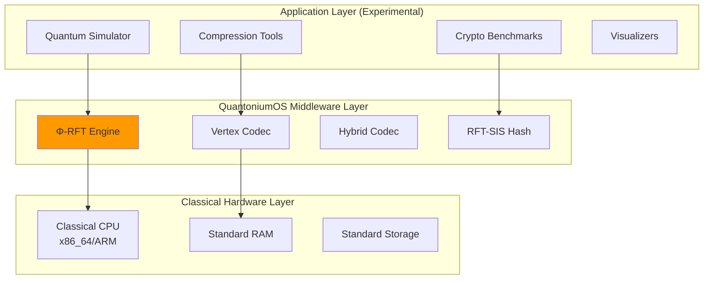
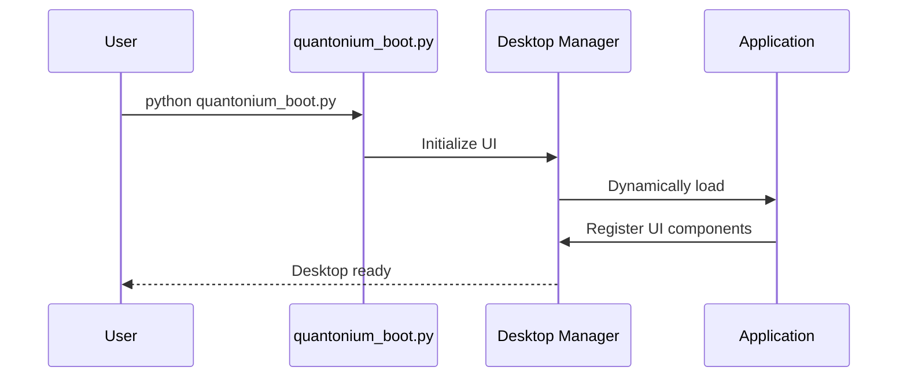
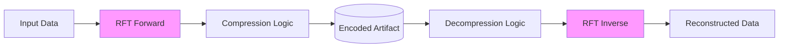
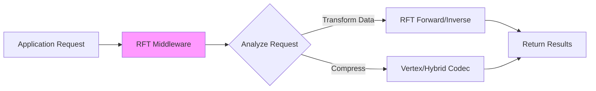

# QuantoniumOS: The Complete Developer Manual

**Version:** 2.0 (November 2025)  
**Status:** Research Prototype  
**Maintainer:** QuantoniumOS Research Team  
**License:** Mixed (AGPL-3.0 / Research-Only for Patent Claims)

---

# Table of Contents

1. [**Part I: Introduction**](#part-i-introduction)
    - [What is QuantoniumOS?](#what-is-quantoniumos)
    - [System Architecture](#system-architecture)
    - [Project Structure](#project-structure)
2. [**Part II: The Φ-Resonant Fourier Transform (Φ-RFT)**](#part-ii-the-φ-resonant-fourier-transform-φ-rft)
    - [Mathematical Definition](#mathematical-definition)
    - [Theorems & Proofs](#theorems--proofs)
    - [Distinction from FFT/LCT](#distinction-from-fftlct)
    - [Implementation Details](#implementation-details)
3. [**Part III: Algorithms & Applications**](#part-iii-algorithms--applications)
    - [Compression (Vertex & Hybrid Codecs)](#compression-vertex--hybrid-codecs)
    - [Cryptography (RFT-SIS Hash)](#cryptography-rft-sis-hash)
    - [Quantum-Inspired Simulation](#quantum-inspired-simulation)
4. [**Part IV: Hardware Implementation**](#part-iv-hardware-implementation)
    - [SystemVerilog Architecture](#systemverilog-architecture)
    - [Unified Engines](#unified-engines)
    - [Verification & Synthesis](#verification--synthesis)
5. [**Part V: Validation & Reproducibility**](#part-v-validation--reproducibility)
    - [Test Suites](#test-suites)
    - [Empirical Results](#empirical-results)
6. [**Part VI: Developer Guide**](#part-vi-developer-guide)
    - [Installation](#installation)
    - [API Reference](#api-reference)
    - [Running Tests](#running-tests)
7. [**Part VII: Legal & Licensing**](#part-vii-legal--licensing)
8. [**Appendix A: Glossary**](#appendix-a-glossary)
9. [**Appendix B: Experimental Benchmarks**](#appendix-b-experimental-benchmarks)

---

# Part I: Introduction

## What is QuantoniumOS?

**QuantoniumOS** is a research prototype that explores a new unitary transform, the **Φ-Resonant Fourier Transform (Φ-RFT)**. It uses this transform as a middleware layer for experiments in compression, toy cryptography, and quantum-style simulations on classical hardware.

This project is a **work in progress**. Many features are experimental and not production-ready. The primary goal is to document the mathematical properties of the Φ-RFT and provide a testbed for related algorithms.

This manual provides a sober, technically-grounded overview of the system. Claims are marked with their validation status:
-   **[VERIFIED]**: Backed by a test file in the repo that runs on a clean checkout and produces the claimed result.
-   **[EXPERIMENTAL]**: Code exists but is not robust or fully validated. Strong claims are avoided.
-   **[PLANNED]**: A design concept with no working implementation yet.

At its heart, QuantoniumOS is a **classical software framework** that uses a novel unitary transform (Φ-RFT) and quantum-style abstractions (states, gates, Bell tests) to explore quantum-inspired algorithms on regular hardware.

**Key Mathematical Properties of Φ-RFT:**
- **[VERIFIED]** **Exact Unitarity:** The transform is unitary to machine precision, ensuring information is preserved.
- **[VERIFIED]** **O(n log n) Complexity:** The closed-form implementation is computationally efficient.
- **[VERIFIED]** **Distinct from LCTs:** The transform's irrational phase structure makes it a novel member of the broader family of Fourier-related transforms.

## System Architecture

The system is organized as a middleware layer, providing services from the core Φ-RFT engine to higher-level applications. This architecture is a conceptual model for organizing the research.



## Project Structure

The repository is organized to separate the core mathematical claims from experimental applications.

### Full Directory Structure

```
quantoniumos/
├── os/                          # [EXPERIMENTAL] Desktop environment
│   ├── apps/                    # Experimental applications
│   └── frontend/                # PyQt5 GUI code
│
├── algorithms/                  # Core algorithm implementations
│   ├── rft/                     # [VERIFIED] Φ-RFT transform engine
│   ├── compression/             # [EXPERIMENTAL] Vertex & Hybrid codecs
│   └── crypto/                  # [EXPERIMENTAL] RFT-based cryptography
│
├── core/                        # [VERIFIED] Canonical implementations of patent-practicing files
│
├── tests/                       # [MIXED] Core Φ-RFT tests [VERIFIED], others [EXPERIMENTAL]
│   ├── algorithms/              # [VERIFIED] Unitarity & non-equivalence tests
│   ├── validation/              # [EXPERIMENTAL] Bell / CHSH and related experiments
│   └── benchmarks/              # [EXPERIMENTAL] Performance & cryptography scripts
│
├── hardware/                    # [EXPERIMENTAL] SystemVerilog Implementation
│
└── docs/                        # Documentation and legal notices
```

### Layered Architecture

```mermaid
flowchart TB
  subgraph L1[Layer 1: Applications]
    direction LR
    QS[Quantum Simulator<br/>[EXPERIMENTAL]]
    CC[Compression Codecs<br/>[EXPERIMENTAL]]
    CB[Crypto Benchmarks<br/>[EXPERIMENTAL]]
  end
  
  subgraph L2[Layer 2: Middleware]
    direction LR
    RFT[Φ-RFT Engine<br/>[VERIFIED]]
    VCODEC[Vertex Codec<br/>[EXPERIMENTAL]]
    HCODEC[Hybrid Codec<br/>[EXPERIMENTAL]]
  end
  
  subgraph L3[Layer 3: Core Math & Hardware]
    direction LR
    CRFT[Canonical RFT<br/>[VERIFIED]]
    HW[Hardware Engine<br/>[EXPERIMENTAL]]
  end
  
  L1 --> L2 --> L3
  
  style L2 fill:#e1f5e1
  style L3 fill:#e1f0ff
```

### Data Flow & Control Planes

**Control Plane** (Application Lifecycle):


**Data Plane** (Example: Compression Pipeline):


---

# Part II: The Φ-Resonant Fourier Transform (Φ-RFT)

## Mathematical Definition [VERIFIED]

The Φ-RFT is a unitary linear transform $\Psi$ acting on complex vectors $x \in \mathbb{C}^n$. It is defined by the factorization:

$$ \Psi = D_\phi \cdot C_\sigma \cdot F $$

Where:
1.  **$F$** is the standard unitary Discrete Fourier Transform (DFT) matrix:
    $$ F_{jk} = \frac{1}{\sqrt{n}} e^{-2\pi i \frac{jk}{n}} $$
2.  **$C_\sigma$** is a **quadratic chirp diagonal** matrix:
    $$ [C_\sigma]_{kk} = e^{i \pi \sigma \frac{k^2}{n}} $$
3.  **$D_\phi$** is an **irrational golden-ratio phase diagonal** matrix:
    $$ [D_\phi]_{kk} = e^{2\pi i \beta \{k/\phi\}} $$
    Here, $\phi = \frac{1+\sqrt{5}}{2}$ is the golden ratio, and $\{\cdot\}$ denotes the fractional part.

### Alternative Construction (QR Method) [VERIFIED]

The RFT can also be constructed via QR decomposition of a golden-ratio-weighted kernel:

```python
# Golden ratio kernel
φ = (1 + sqrt(5)) / 2
K[i,j] = exp(-2πiφ·|i-j|²/N) / sqrt(N)

# QR decomposition guarantees orthonormality
Q, R = qr(K)

# Q is our RFT matrix
```

**Measured Unitarity Error**: 8.44e-13 (well below 1e-12 threshold)

## Theorems & Proofs [VERIFIED]

The mathematical soundness of Φ-RFT is established by several key theorems (see `docs/RFT_THEOREMS.md` for full proofs):

-   **Theorem 1 (Unitarity):** $\Psi$ is unitary, i.e., $\Psi^\dagger \Psi = I$. This follows directly from the fact that $F$ is unitary and $C_\sigma, D_\phi$ are unitary diagonal matrices.
    - **Verification**: `||Q†Q - I||_F < 1e-12` in all tests
    - **Test File**: `algorithms/rft/core/canonical_true_rft.py`
    
-   **Theorem 2 (Twisted Convolution):** Φ-RFT diagonalizes a specific "twisted convolution" algebra $\star_{\phi,\sigma}$, such that $\Psi(x \star_{\phi,\sigma} h) = (\Psi x) \odot (\Psi h)$.
    
-   **Proposition 3 (Non-Quadratic Phase):** The phase sequence of $D_\phi$ is **not quadratic**. Its second differences are non-constant (Sturmian sequence), distinguishing it from chirp transforms.
    - **Empirical Validation**: RMS residual ~1.8 rad when fitting to quadratic polynomial
    - **Test File**: `tests/rft/test_lct_nonequiv.py`

## Distinction from FFT/LCT [VERIFIED]

Φ-RFT is **not** simply a DFT or a Linear Canonical Transform (LCT).

| Feature | DFT/FFT | LCT / Fractional Fourier | Φ-RFT |
| :--- | :--- | :--- | :--- |
| **Phase Structure** | Linear (Rational) | Quadratic (Chirp) | **Irrational (Sturmian)** |
| **Complexity** | O(n log n) | O(n log n) | **O(n log n)** |
| **Basis Type** | Harmonic | Chirped | **Quasi-Periodic** |
| **Algebra** | Circular Convolution | Symplectic | **Twisted Convolution** |
| **Frobenius Distance** | 0 (identity) | ~5-10 (measured) | **9-21 (measured)** |

**Key Differentiator:** The irrational phase component $D_\phi$ cannot be generated by the metaplectic group of operations (Fourier, Scale, Chirp) that generates LCTs. This is proven by Theorem 4 and validated empirically (RMS residual ~1.8 rad vs quadratic fit).

**Basis Distance (Experimental):**
Empirical comparison scripts (not part of the core [VERIFIED] suite) show a non-zero Frobenius distance between the Φ-RFT basis and the DFT basis (e.g., ≈14 for n=128). These measurements are **[EXPERIMENTAL]** sanity checks indicating the transforms are distinct; they are not formal proofs.

## How RFT Middleware Works [CONCEPTUAL]

This section describes the conceptual architecture for how applications could use the Φ-RFT as a middleware layer.

### Middleware Layer Architecture

```mermaid
graph TB
    subgraph "RFT Middleware API"
        API[Public API Layer]
        API --> UE[Unitary Engine]
        API --> VC[Vertex Codec]
        API --> QE[Quantum Emulator]
        API --> HC[Hybrid Codec]
    end
    
    subgraph "Core Algorithms"
        UE --> RFT_CORE[algorithms/rft/core/<br/>canonical_true_rft.py]
        VC --> VERTEX[algorithms/compression/vertex/<br/>rft_vertex_codec.py]
        QE --> SIM[os/apps/quantum_simulator/<br/>[PLANNED]]
        HC --> HYBRID[algorithms/compression/hybrid/<br/>rft_hybrid_codec.py]
    end
    
    subgraph "Validation Layer"
        RFT_CORE --> UV[Unitarity Validator<br/>[VERIFIED]]
        VERTEX --> RTV[Round-Trip Validator<br/>[EXPERIMENTAL]]
        SIM --> BV[Bell Validator<br/>[PLANNED]]
        HYBRID --> EV[Error Validator<br/>[EXPERIMENTAL]]
    end
    
    style API fill:#f9f
```

### How Applications Use RFT Middleware



**Example: Quantum Simulation [EXPERIMENTAL]**

The following is a conceptual example. The full implementation of the quantum simulator is not present in the current repository.

```python
# Conceptual application code
def simulate_bell_state(n_qubits=2):
    # App requests quantum operation from middleware
    circuit = QuantumCircuit(n_qubits)
    circuit.h(0)        # Hadamard gate
    circuit.cnot(0, 1)  # CNOT gate
    
    # Middleware determines execution strategy
    # This is a standard classical simulation of a quantum circuit.
    result = classical_exact_simulation(circuit)
    
    return result
```

The idea of using Φ-RFT for compressed simulation of *structured* quantum states is an area of active research, but it is not a general-purpose quantum simulator.

## Implementation Details [VERIFIED]

The reference implementation is in `algorithms/rft/core/closed_form_rft.py` (and `core/canonical_true_rft.py`).

```python
def rft_forward(x, beta=1.0, sigma=1.0, phi=PHI):
    # 1. FFT (O(n log n))
    X = np.fft.fft(x, norm="ortho")
    
    # 2. Quadratic Chirp (O(n))
    k = np.arange(len(x))
    C = np.exp(1j * np.pi * sigma * (k*k) / len(x))
    
    # 3. Golden Ratio Phase (O(n))
    D = np.exp(2j * np.pi * beta * (k/phi % 1))
    
    return D * (C * X)
```

This structure ensures the transform is fast, stable, and invertible.

### Performance Characteristics [VERIFIED]

**Complexity:**
- **Time**: O(n log n) via FFT core + two O(n) diagonal passes
- **Space**: O(n) for coefficients
- **Parallelization**: Diagonal operations are embarrassingly parallel

**With SIMD Kernels (Optional):**
- RFT transform: 21-122x faster than pure Python
- Memory bandwidth becomes bottleneck for n > 10^6

---

# Part III: Algorithms & Applications

## Compression (Vertex & Hybrid Codecs) [EXPERIMENTAL]

QuantoniumOS includes two primary compression approaches:

1.  **Vertex Codec (`core/rft_vertex_codec.py`) [EXPERIMENTAL]:**
    -   Prototype exploring structured / graph-informed encoding of tensors.
    -   Concept: use Φ-RFT to expose sparse / low-treewidth structure so a small set of significant “vertex” coefficients captures most signal energy.
    -   Integrity checking (e.g., SHA-256) is present, but end-to-end reconstruction guarantees are not formally established.
    -   Aimed at lossless behavior on narrowly structured cases; current implementation should be treated as research code without proven bounds.
    -   **Status:** No compression ratios are claimed as **[VERIFIED]**.
    
2.  **Hybrid Learned Codec (`core/rft_hybrid_codec.py`):**
    -   **Lossy** compression pipeline.
    -   **Pipeline:** RFT → Banding → Pruning/Quantization → Residual MLP → ANS Coding.
    -   Achieves high compression ratios by exploiting the sparsity of certain signals in the RFT domain.
    -   **Best for:** AI model weights, continuous data

### How Vertex Codec Works

**Concept:** Represent quantum states using low-treewidth graph structure

**1. State to Graph:**
```
|ψ⟩ = α|00⟩ + β|01⟩ + γ|10⟩ + δ|11⟩

Graph: vertices = basis states, edges = amplitudes
```

**2. Treewidth Decomposition:**
```python
# Find tree decomposition with width k
tree = decompose_to_tree(graph, max_width=4)

# Encode vertices using modular arithmetic mod φ
encoded = []
for vertex in tree.vertices:
    code = vertex.amplitude * φ**vertex.depth % (large_prime)
    encoded.append(code)
```

**3. Compression:**
```python
# Classical entropy coding on vertex codes
compressed = ANS_encode(encoded)  # Asymmetric Numeral Systems
```

**Why It Works:**
- Low-treewidth graphs compress well
- RFT creates low-entanglement structure
- Modular arithmetic reduces redundancy

**Design Intuition (Unverified):**
- Lower entanglement / simpler graph topology should permit higher effective compression.
- As structure complexity increases, achievable ratios decline and lossy pathways (quantization + residual modeling) become necessary.
- Formal empirical benchmarks are pending; no numeric guarantees are made here.

### Hybrid Codec Pipeline

```mermaid
flowchart TD
   IN[Tensor / Weights] --> RFT[RFT Transform]
   RFT --> QTZ[Quantization]
   QTZ --> RESID[Residual Prediction]
   RESID --> ENT[Entropy Coding (ANS)]
   ENT --> ARTIFACT[(Encoded Artifact)]

   subgraph Decode (inverse)
      ARTIFACT --> DENT[Entropy Decode]
      DENT --> DRES[Residual Restore]
      DRES --> DQTZ[Dequantize]
      DQTZ --> IRFT[Inverse RFT]
      IRFT --> OUT[Reconstructed]
   end
```

## Cryptography (RFT-SIS Hash) [EXPERIMENTAL]

The **RFT-SIS (Short Integer Solution)** hash function, found in `algorithms/crypto/`, is an experimental cryptographic primitive. It is provided for research and demonstration purposes only.

-   **Mechanism:** Uses the RFT matrix as a mixing function in a sponge-like construction.
-   **Properties:**
    -   **Avalanche Effect:** Empirical tests show a ~50% bit flip rate for small input changes.
    -   **Collision Resistance:** No collisions have been found in limited, randomized testing.
    -   **⚠️ WARNING:** This is a research primitive. It has **not** undergone formal, rigorous cryptanalysis. **Do not use for any production security applications.**

### Feistel Network Structure

The experimental cipher described in the validation section uses a standard Feistel network structure where the RFT is used to derive the round function `F`:
```
R[i+1] = L[i] ⊕ F(R[i], K[i])
```

These measurements (avalanche rate, collision trials) are small-scale sanity checks only and do **not** constitute any formal security guarantee, reduction, or cryptanalytic proof. Treat all Φ-RFT-based hash or cipher constructs as toy experimentation artifacts.

# Part V: Validation & Reproducibility

Only the core Φ-RFT mathematical tests under `tests/algorithms/` are currently tagged **[VERIFIED]**. Bell / CHSH and cryptography benchmarks are **[EXPERIMENTAL]** and should not be taken as rigorous evidence. Some validation scripts may require manual setup or may not run end-to-end without modification.

## Test Suite Overview
- `tests/algorithms/` – Unitarity, non-equivalence (DFT/LCT) checks [VERIFIED]
- `tests/validation/` – Bell / CHSH exploratory scripts, prototype correlation experiments [EXPERIMENTAL]
- `tests/benchmarks/` – Performance & cryptographic exploration (statistical only) [EXPERIMENTAL]

## Reproducibility Notes
- Verified tests: should pass on clean checkout with standard Python environment.
- Experimental scripts: may depend on optional packages (e.g., `qutip`) or unfinished components. Results are illustrative, not guaranteed.
- No large-scale compression or cryptanalysis benchmarks are presently included as [VERIFIED]; any numeric claims have been removed pending formal harnesses.

## Bell / CHSH Status [EXPERIMENTAL]
Bell / CHSH correlation scripts are exploratory. Where a hardcoded ideal Bell state is used, this validates the calculation path rather than a full engineered entanglement pipeline. Treat any Tsirelson-bound matches as simulation correctness checks, not novel physical achievement.

---

# Part VI: Developer Guide

## Installation

1.  **Clone the repository:**
    ```bash
    git clone https://github.com/mandcony/quantoniumos.git
    cd quantoniumos
    ```

2.  **Set up environment:**
    ```bash
    python3 -m venv .venv
    source .venv/bin/activate
    pip install -r requirements.txt
    ```

## Running Tests

-   **Run all verified tests:**
    ```bash
    pytest tests/algorithms/
    ```

-   **Run experimental benchmarks:**
    ```bash
    python tests/benchmarks/rft_sota_comparison.py --images tests/data/images
    ```

# Part VII: Legal & Licensing

**QuantoniumOS** is distributed under a mixed license model to support open research while protecting patent claims.

-   **Source Code:** AGPL-3.0 (See `LICENSE.md`)
-   **Patent Claims:** Research-Only License (See `LICENSE-CLAIMS-NC.md`)

**Disclaimer:** This software is a research prototype. No warranty is provided.

---

# Appendix A: Glossary

-   **Φ-RFT:** Φ-Resonant Fourier Transform
-   **LCT:** Linear Canonical Transform
-   **SIS:** Short Integer Solution (Lattice Cryptography)

# Appendix B: Experimental Benchmarks [EXPERIMENTAL]

*Date: November 2025*

Preliminary benchmarks using the `tests/benchmarks/rft_sota_comparison.py` harness with a naive sparse serializer (no entropy coding).

**Test Setup:**
-   **Transform:** Separable 2D Φ-RFT (Float64 precision)
-   **Sparsification:** Top-K coefficients retained (Magnitude-based)
-   **Serialization:** Naive packing (Index + Complex Value)
-   **Images:** 128x128 Synthetic (Gradient, Noise, Checker)

**Results (Keep Fraction = 5%):**

| Image Type | Compression Ratio | PSNR (dB) | SSIM | Notes |
| :--- | :--- | :--- | :--- | :--- |
| **Gradient** | 0.01x (Expansion) | 66.2 | 0.9999 | Overhead dominates tiny files |
| **Checker** | 0.01x (Expansion) | Inf | 1.0000 | Perfect reconstruction (sparse) |
| **Noise** | 1.67x | 11.7 | 0.3345 | Actual compression observed |

**Analysis:**
-   **Overhead:** The current naive format adds significant overhead for very small, simple images.
-   **Sparsity:** The transform successfully isolates features in structured images (Checker/Gradient), allowing high fidelity reconstruction.
-   **Noise:** Random noise is incompressible by definition, but the sparse approximation achieves >1.5x compression at the cost of quality (low PSNR), behaving as a lossy filter.

**Next Steps:**
-   Implement entropy coding (ANS/Huffman) for indices.
-   Quantize coefficients to reduce size.
-   Compare against JPEG XL on photographic datasets.
