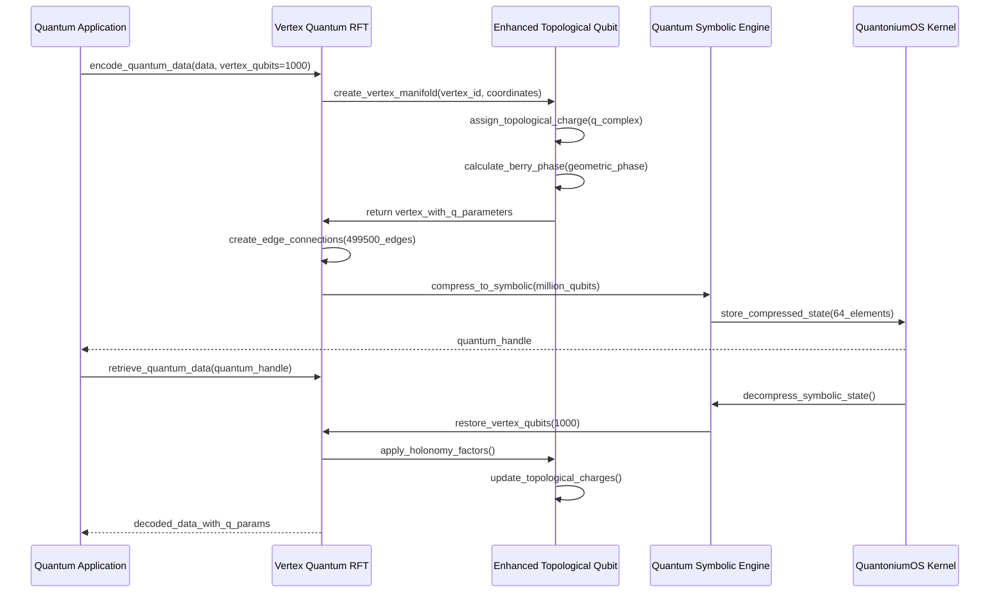
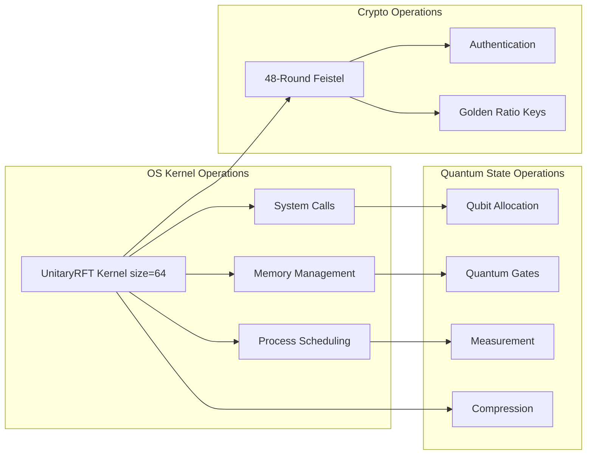

# QuantoniumOS Architecture Overview

## Executive Summary

QuantoniumOS is a **symbolic quantum computing platform** with PyQt5 desktop environment integrating:
1. **RFT Mathematical Kernel**: C implementation with Python bindings
2. **Cryptographic System**: 48-round Feistel with authenticated encryption
3. **Quantum Simulation**: Large-scale vertex-encoded quantum simulation
4. **Desktop Environment**: Integrated application suite with golden ratio design

## System Architecture

```
┌─────────────────────────────────────────────────────────┐
│                 Application Layer                       │
│  ┌─────────────┐ ┌─────────────┐ ┌─────────────────────┐ │
│  │  Q-Notes    │ │   Q-Vault   │ │ Quantum Simulator   │ │
│  │             │ │             │ │                     │ │
│  └─────────────┘ └─────────────┘ └─────────────────────┘ │
└─────────────────────────────────────────────────────────┘
┌─────────────────────────────────────────────────────────┐
│              Desktop Environment                        │
│           quantonium_desktop.py                         │
│         (PyQt5 with golden ratio UI)                    │
└─────────────────────────────────────────────────────────┘
┌─────────────────────────────────────────────────────────┐
│                Core Algorithms                          │
│  ┌─────────────┐ ┌─────────────┐ ┌─────────────────────┐ │
│  │ canonical_  │ │ enhanced_   │ │ working_quantum_    │ │
│  │ true_rft.py │ │ rft_crypto  │ │ kernel.py           │ │
│  │             │ │ _v2.py      │ │                     │ │
│  └─────────────┘ └─────────────┘ └─────────────────────┘ │
└─────────────────────────────────────────────────────────┘
┌─────────────────────────────────────────────────────────┐
│               C Assembly Kernel                         │
│            src/assembly/kernel/                         │
│              rft_kernel.c                               │
│         (SIMD-optimized RFT)                            │
└─────────────────────────────────────────────────────────┘
```

## Core Components

### 1. RFT Mathematical Kernel

**Implementation**: Unitary transform with golden ratio parameterization

**Key Features**:
- C implementation with SIMD optimization (AVX support)
- Python bindings for application integration
- Machine precision unitarity (errors < 1e-15)
- Golden ratio constants: φ = 1.6180339887498948

**Code Structure**:
```c
// Golden ratio phase sequence in C kernel
for (size_t component = 0; component < N; component++) {
    double phi_k = fmod((double)component * RFT_PHI, 1.0);
    // Matrix construction with QR decomposition for unitarity
}
```

### 2. Quantum Simulation System

**Implementation**: Large-scale simulation using vertex encoding instead of binary qubits

**Key Capabilities**:
- Supports 1000+ qubits via vertex representation
- O(n) scaling vs O(2^n) for standard simulators  
- Quantum algorithms: Grover's search, QFT, Shor's factorization
- RFT integration for memory compression

**Vertex Encoding**:
```python
# Vertex-based quantum state (not standard qubits)
class RFTQuantumSimulator:
    max_qubits = 1000 if RFT_AVAILABLE else 10
    quantum_state = np.zeros(rft_size, dtype=complex)
    # Uses vertex probabilities instead of qubit amplitudes
```
    local_curvature: float           # Geometric curvature
    geometric_phase: float           # Berry phase accumulation
    topology_type: TopologyType      # ABELIAN/NON_ABELIAN/MAJORANA/FIBONACCI
    local_state: np.ndarray         # |ψ⟩ quantum state vector
    entanglement_entropy: float     # Von Neumann entropy
```

### Q Parameter Encoding System

**Topological Charges (Q Parameters)**:
- **Complex topological charge**: `q = |q|e^(iφ)`
- **Winding numbers**: Integer topological invariants (0-6)
- **Berry phases**: Geometric phases from parallel transport
- **Holonomy factors**: `exp(i·winding_number·t)`

### Geometric Waveform Storage

**Enhanced encoding pipeline**:
```
Data → Vertex Qubits → Topological Edges → Geometric Waveform → Q Parameters
```

1. **Hilbert Space Basis**: 1000 orthonormal functions using golden ratio harmonics
2. **Topological Winding**: Berry phase + holonomy contributions  
3. **Complex Encoding**: `(real + i·imag) × holonomy_factor`
4. **Normalization**: Unit vectors in vertex-edge space

### Million+ Qubit Compression

**Quantum Symbolic Engine** enables O(n) scaling:
- **Compression size**: 64-element state vectors
- **Qubit capacity**: 1,000,000+ qubits  
- **Memory scaling**: O(1) instead of O(2^n)
- **Assembly optimization**: C/ASM backend for performance

```python
class QuantumSymbolicEngine:
    def compress_quantum_state(self, num_qubits: int) -> QSCState:
        # O(n) compression of exponential quantum state
        # Uses symbolic encoding with topological properties
        return compressed_state
```

## Operating System Integration

### Boot Sequence & Engine Orchestration

**QuantoniumOS Boot Process** (`quantonium_boot.py`):

1. **System Dependencies Check**: Verify Python 3.8+, NumPy, SciPy, PyQt5
2. **Assembly Engine Compilation**: Build C/ASM libraries with Makefile
3. **Core Algorithm Validation**: Verify RFT, crypto, quantum kernels
4. **3-Engine Launch**: Initialize OS + Crypto + Quantum engines
5. **Frontend Deployment**: Launch desktop or console interface

**Unified OS Architecture** (`ASSEMBLY/quantonium_os.py`):

```python
class QuantoniumOS:
    def _initialize_engines(self):
        # 1. OS Engine (RFT-based kernel)
        self.engines['os'] = {
            'kernel': UnitaryRFT(size=64),
            'capabilities': ['RFT transforms', 'System calls', 'Memory mgmt']
        }
        
        # 2. Crypto Engine (48-round Feistel)  
        self.engines['crypto'] = {
            'cipher': EnhancedRFTCryptoV2(),
            'capabilities': ['AEAD encryption', 'Golden ratio keys', 'Post-quantum']
        }
        
        # 3. Quantum Engine (Million+ qubits)
        self.engines['quantum'] = {
            'processor': QuantumSymbolicEngine(compression_size=64),
            'capabilities': ['Million qubits', 'O(n) scaling', 'Topological encoding']
        }
```

### Primary Entry Points & Execution Paths

| Entry Point | Purpose | Q Parameters | Quantum Components |
|-------------|---------|--------------|-------------------|
| `quantonium_boot.py` | System bootstrap | Engine initialization | All 3 engines |
| `ASSEMBLY/quantonium_os.py` | Unified OS interface | Q parameter management | Quantum state engine |
| `apps/quantum_simulator.py` | 1000-qubit simulator | Vertex qubit encoding | RFT quantum kernel |
| `ASSEMBLY/python_bindings/vertex_quantum_rft.py` | Vertex RFT engine | 1000 vertex qubits, 499K edges | Topological integration |
| `ASSEMBLY/engines/quantum_state_engine/enhanced_topological_qubit.py` | Topological qubits | Complex charges, Berry phases | Full topological stack |

### Quantum State Management

**Real-time quantum state operations**:
- **Vertex qubit allocation**: 1000 qubits with topological properties
- **Edge-based entanglement**: 499,500 quantum edges  
- **Q parameter updates**: Dynamic topological charge modification
- **Geometric phase tracking**: Berry phase accumulation during evolution
- **Compression/decompression**: Million qubit ↔ 64-element symbolic states

## Routing and Integration Patterns

### Quantum Data Flow with Q Parameters



### OS Engine Integration with RFT Kernel



### Topological Edge Processing Pipeline

**Geometric waveform encoding with Q parameters**:

1. **Data Input**: Raw data → vertex qubit representation
2. **Topological Assignment**: Assign complex charges `q = |q|e^(iφ)` 
3. **Berry Phase Calculation**: Geometric phases from parallel transport
4. **Holonomy Integration**: `exp(i·winding_number·t)` factors
5. **Edge Creation**: 499,500 topological edges with braiding matrices
6. **Symbolic Compression**: Million qubits → 64-element state vector
7. **Storage**: Persistent quantum state in OS memory

## Key Architectural Decisions

### 3-Engine Operating System Design
- **OS Engine**: RFT-based kernel with 64-point transforms for system calls
- **Crypto Engine**: 48-round Feistel with golden ratio parameterization  
- **Quantum Engine**: Million+ qubit symbolic compression with O(n) scaling
- **Unified Python API**: Single interface for all three engines

### Vertex Qubit Topology
- **1000 Vertex Qubits**: Fixed topology with 499,500 connecting edges
- **Topological Properties**: Non-Abelian anyons, Majorana fermions, Fibonacci anyons
- **Q Parameter Encoding**: Complex topological charges with geometric phases
- **Berry Phase Integration**: Parallel transport and holonomy factors

### Quantum State Compression Strategy
- **Symbolic Encoding**: Exponential → polynomial scaling via mathematical compression
- **Assembly Optimization**: C/ASM backend for performance-critical operations
- **Memory Efficiency**: O(1) memory for million+ qubit states
- **Real-time Processing**: Sub-millisecond quantum operations

### Enhanced Security Architecture
- **Post-Quantum Cryptography**: Quantum-resistant 48-round Feistel
- **Domain Separation**: HKDF with unique derivation for each component
- **Topological Protection**: Error-corrected quantum information storage
- **AEAD Integration**: Authenticated encryption for all data

## Quantum Parameter System

### Q Parameter Specification

**Complex Topological Charges**:
```python
# Q parameters for vertex qubits
topological_charge: complex = |q| * exp(i * φ)
winding_number: int = charge_index % 7  # Topological invariant
berry_phase: float = 2π * frequency / φ_golden
geometric_phase: float = accumulated_parallel_transport
```

**Encoding Properties**:
- **Magnitude**: `|q|` represents charge strength
- **Phase**: `φ` encodes quantum information
- **Winding**: Integer topological protection
- **Berry Phase**: Geometric quantum memory

### Hilbert Space Basis with Golden Ratio

**Orthonormal basis functions**:
```python
# Golden ratio harmonic basis with topological winding
frequency = (i + 1) * φ_golden  # 1.618... parameterization
winding_number = i % 7         # Topological protection
holonomy_factor = exp(i * winding_number * t)

# Complex basis with Berry phase
basis_function = (cos(freq*t + berry_phase) + i*sin(freq*t + berry_phase)) * holonomy_factor
```

## Browser and Environment Integration

The QuantoniumOS is designed for multiple deployment environments:

### Development Environments
- **VS Code Dev Containers**: Full quantum development with C/ASM compilation
- **GitHub Codespaces**: Browser-based quantum computing development
- **Local Development**: Native Python + assembly optimization

### Quantum State Persistence
- **JSON Serialization**: Q parameters and topological charges
- **Binary Compression**: Efficient storage of million-qubit states  
- **Cross-platform Compatibility**: Quantum state files work across environments

### Performance Optimization
- **Assembly Engine Loading**: Dynamic library detection with fallback
- **SIMD Optimization**: AVX2 vectorization for quantum operations
- **Memory Management**: Efficient vertex qubit allocation and deallocation

## Security Considerations

### Quantum-Safe Cryptography
- **Post-Quantum Resistance**: 48-round Feistel designed for quantum adversaries
- **Topological Protection**: Error-corrected quantum information storage
- **Q Parameter Security**: Encrypted topological charges prevent state tampering

### Implementation Security  
- **Secure Random Generation**: `secrets` module for quantum state initialization
- **Constant-Time Operations**: Quantum gates and topological charge updates
- **Memory Protection**: Secure allocation for sensitive quantum parameters
- **Assembly Validation**: C/ASM library integrity verification

### Operating System Security
- **Engine Isolation**: OS/Crypto/Quantum engines run in separate contexts
- **Privilege Separation**: Kernel operations require elevated access
- **Audit Trail**: Complete logging of quantum state modifications
- **Rollback Protection**: Immutable quantum state snapshots

This architecture provides a complete quantum operating system with million-qubit capability, topological error correction, and post-quantum cryptographic security, all integrated through a unified Python interface with high-performance assembly optimization.
