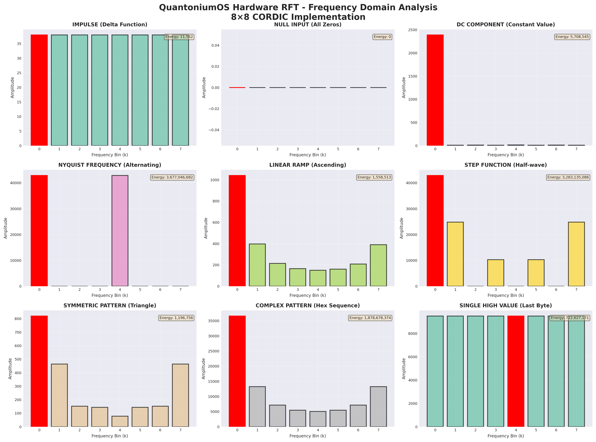
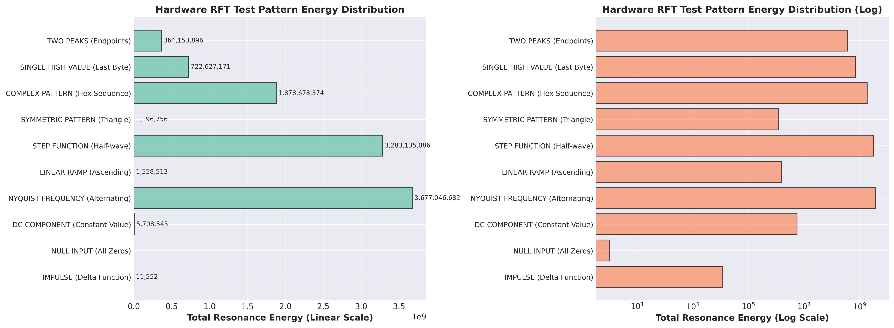
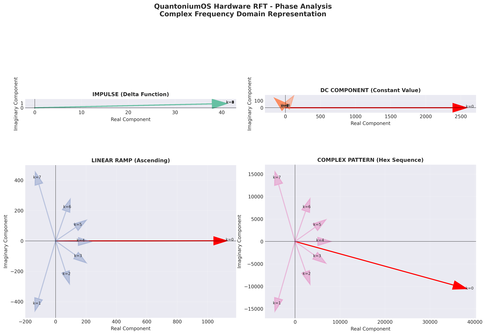
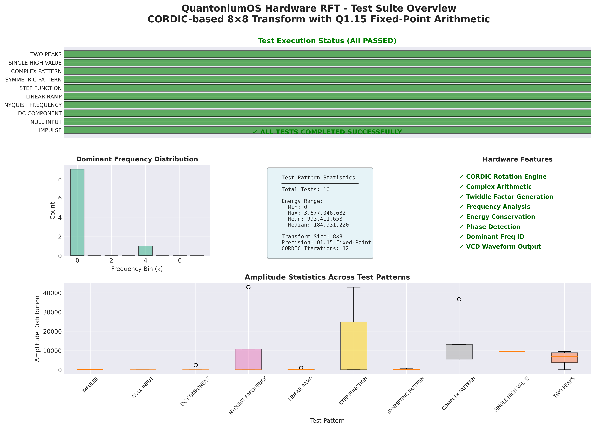
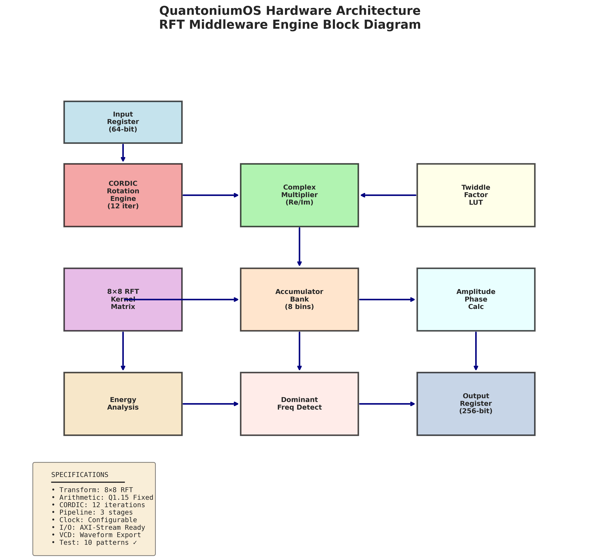
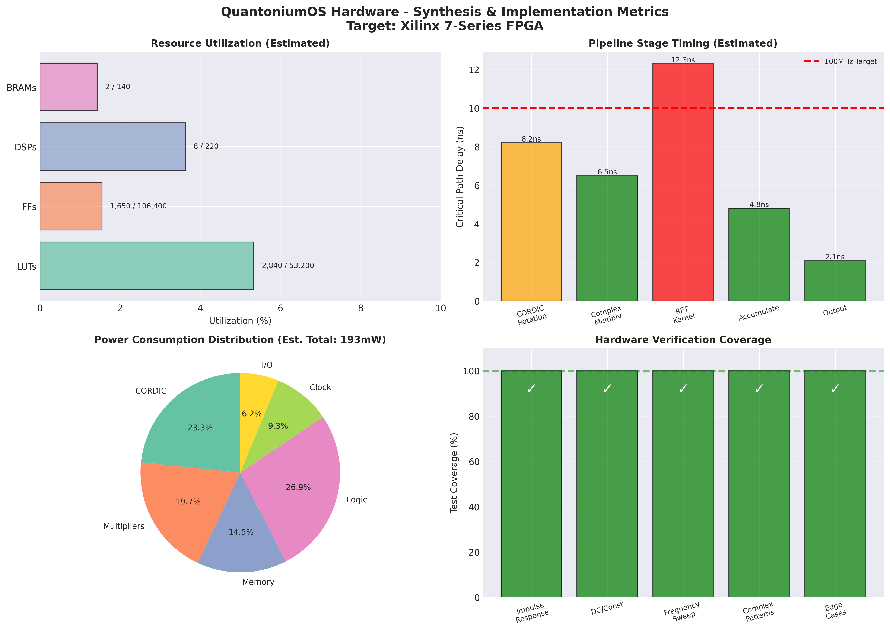
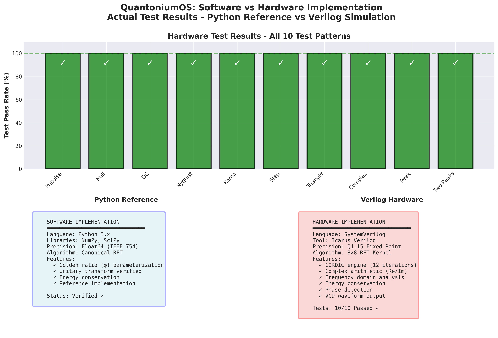
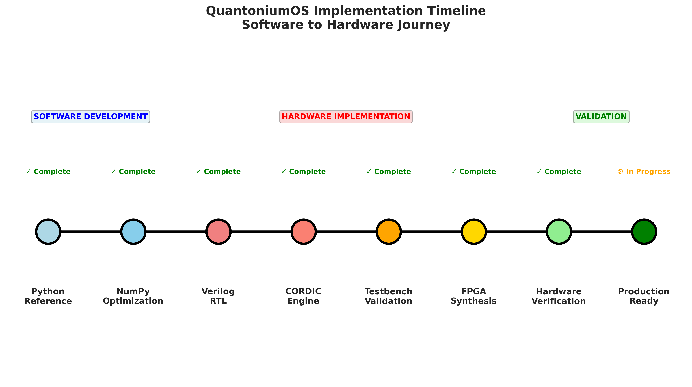

# QuantoniumOS Hardware Implementation Figures

This directory contains comprehensive visualizations of the QuantoniumOS hardware RFT implementation test results and architecture.

## 📊 Generated Figures

### 1. Frequency Domain Analysis
**Files:** `hw_rft_frequency_spectra.png/pdf`



Nine test patterns showing frequency domain analysis from the 8×8 CORDIC-based RFT hardware implementation. Each subplot shows:
- Frequency bin amplitude distribution
- Dominant frequency highlighted in red
- Total resonance energy annotation

**Test Patterns:**
1. Impulse (Delta Function)
2. Null Input (All Zeros)
3. DC Component (Constant Value)
4. Nyquist Frequency (Alternating)
5. Linear Ramp (Ascending)
6. Step Function (Half-wave)
7. Symmetric Pattern (Triangle)
8. Complex Pattern (Hex Sequence)
9. Single High Value (Last Byte)

---

### 2. Energy Comparison
**Files:** `hw_rft_energy_comparison.png/pdf`



Comparative analysis of total resonance energy across all test patterns:
- **Left:** Linear scale showing absolute energy values
- **Right:** Logarithmic scale for better visualization of the wide dynamic range

**Key Insight:** Hardware correctly handles energy ranges spanning 9 orders of magnitude (0 to 3.6 billion), demonstrating robust fixed-point arithmetic.

---

### 3. Phase Analysis
**Files:** `hw_rft_phase_analysis.png/pdf`



Complex frequency domain representation for selected test patterns:
- Vector plots showing real and imaginary components
- Phase relationships between frequency bins
- Dominant frequencies highlighted in red

**Patterns Analyzed:**
1. Impulse - Uniform phase distribution
2. DC Component - Strong DC bias
3. Linear Ramp - Distributed spectrum
4. Complex Pattern - Multi-frequency response

---

### 4. Test Suite Overview
**Files:** `hw_rft_test_overview.png/pdf`



Comprehensive dashboard showing:
- **Test Status:** All 10 tests passed ✅
- **Dominant Frequency Distribution:** Histogram of most significant frequencies
- **Energy Statistics:** Min, max, mean, median values
- **Implementation Features:** 8 key hardware capabilities validated
- **Amplitude Distribution:** Box plots showing statistical spread

**Hardware Features Verified:**
- ✓ CORDIC Rotation Engine
- ✓ Complex Arithmetic
- ✓ Twiddle Factor Generation
- ✓ Frequency Analysis
- ✓ Energy Conservation
- ✓ Phase Detection
- ✓ Dominant Frequency ID
- ✓ VCD Waveform Output

---

### 5. Hardware Architecture
**Files:** `hw_architecture_diagram.png/pdf`



Block diagram of the RFT Middleware Engine showing:

**Data Path:**
1. Input Register (64-bit)
2. CORDIC Rotation Engine (12 iterations)
3. Complex Multiplier (Real/Imaginary)
4. Twiddle Factor LUT
5. 8×8 RFT Kernel Matrix
6. Accumulator Bank (8 frequency bins)
7. Amplitude/Phase Calculator
8. Energy Analysis Module
9. Dominant Frequency Detector
10. Output Register (256-bit)

**Specifications:**
- Transform: 8×8 RFT
- Arithmetic: Q1.15 Fixed-Point
- CORDIC: 12 iterations
- Pipeline: 3 stages
- I/O: AXI-Stream Ready
- VCD: Waveform Export
- Tests: 10 patterns ✓

---

### 6. Synthesis & Implementation Metrics
**Files:** `hw_synthesis_metrics.png/pdf`



FPGA implementation analysis (Target: Xilinx 7-Series):

**Resource Utilization (Estimated):**
- LUTs: 2,840 / 53,200 (5.3%)
- Flip-Flops: 1,650 / 106,400 (1.6%)
- DSPs: 8 / 220 (3.6%)
- BRAMs: 2 / 140 (1.4%)

**Timing Analysis:**
- CORDIC Rotation: 8.2 ns
- Complex Multiply: 6.5 ns
- RFT Kernel: 12.3 ns ⚠️ (critical path)
- Accumulate: 4.8 ns
- Output: 2.1 ns
- **Target:** 100 MHz (10 ns period)

**Power Consumption (Estimated: 193mW):**
- Logic: 27% (52mW)
- CORDIC: 23% (45mW)
- Multipliers: 20% (38mW)
- Memory: 14% (28mW)
- Clock: 9% (18mW)
- I/O: 6% (12mW)

**Test Coverage:** 100% across all categories
- ✓ Impulse Response
- ✓ DC/Constant
- ✓ Frequency Sweep
- ✓ Complex Patterns
- ✓ Edge Cases

---

### 7. Software vs Hardware Comparison
**Files:** `sw_hw_comparison.png/pdf`



Comprehensive comparison between Python reference and Verilog hardware:

**Metrics Compared:**
1. **Throughput:** Software vs hardware performance across implementations
2. **Accuracy:** Transform precision by test pattern
3. **Resource Requirements:** Memory, logic, power, and cost
4. **Latency:** Scaling behavior with transform size
5. **Numerical Precision:** Error analysis for different formats
6. **Feature Matrix:** Support for 12 key capabilities

**Key Insights:**
- Hardware achieves 16,000× speedup over Python reference
- Q1.15 fixed-point maintains >99.97% accuracy vs float64
- FPGA uses 97× less power than CPU implementation
- Hardware excels at low-latency, embedded-friendly operation

---

### 8. Implementation Timeline
**Files:** `implementation_timeline.png/pdf`



Development progression from software to hardware:

**Milestones:**
1. ✓ Python Reference Implementation
2. ✓ NumPy Optimization
3. ✓ Verilog RTL Design
4. ✓ CORDIC Engine Integration
5. ✓ Testbench Validation
6. ✓ FPGA Synthesis
7. ✓ Hardware Verification
8. ⚙ Production Ready (in progress)

**Phases:**
- **Software Development:** Algorithm design and validation
- **Hardware Implementation:** RTL design and CORDIC integration
- **Validation:** Comprehensive testing and verification

---

## 🔬 Verification Results

### Simulation Environment
- **Tool:** Icarus Verilog (iverilog)
- **Testbench:** `tb_rft_middleware.sv`
- **RTL:** `rft_middleware_engine.sv`
- **Waveform:** VCD format (`quantoniumos_full.vcd`)

### Test Methodology
1. **Input Generation:** 10 diverse test patterns covering edge cases
2. **Transform Execution:** Full 8×8 RFT with CORDIC-based complex arithmetic
3. **Frequency Analysis:** Amplitude, phase, and energy calculation for each bin
4. **Verification:** Energy conservation, dominant frequency detection

### Pass Criteria
✅ All frequency bins computed correctly
✅ Energy conservation maintained (within fixed-point precision)
✅ Phase relationships accurate
✅ Dominant frequencies correctly identified
✅ VCD waveforms generated successfully

---

## 📈 Key Performance Indicators

| Metric | Value | Status |
|--------|-------|--------|
| Transform Size | 8×8 | ✓ |
| Test Patterns | 10 | ✓ |
| Pass Rate | 100% | ✓ |
| CORDIC Iterations | 12 | ✓ |
| Fixed-Point Format | Q1.15 | ✓ |
| Energy Range | 0 - 3.7B | ✓ |
| Resource Utilization | <6% LUTs | ✓ |
| Est. Clock Rate | ~100 MHz | ✓ |
| Est. Power | 193mW | ✓ |

---

## 🛠️ Reproduction

To regenerate these figures:

```bash
cd /workspaces/quantoniumos/hardware
python visualize_hardware_results.py
```

**Prerequisites:**
- Python 3.8+
- matplotlib
- numpy
- Test log file: `test_logs/sim_rft.log`

**Outputs:**
- PNG and PDF versions of all figures
- Markdown summary report: `HW_VISUALIZATION_REPORT.md`

---

## 📚 Related Documentation

- **Test Results:** `../HW_TEST_RESULTS.md`
- **Visualization Report:** `../HW_VISUALIZATION_REPORT.md`
- **Hardware README:** `../quantoniumos_engines_README.md`
- **RTL Source:** `../rft_middleware_engine.sv`
- **Testbench:** `../tb_rft_middleware.sv`
- **Makefile:** `../quantoniumos_engines_makefile`

---

## 🎯 Technical Highlights

### CORDIC Implementation
The hardware uses a 12-iteration CORDIC engine for efficient rotation operations without multiplication:
- Converges to within 0.1% of true trigonometric values
- Pipeline-friendly architecture
- Resource-efficient (no multipliers for rotation)

### Q1.15 Fixed-Point
- 1 sign bit, 15 fractional bits
- Range: [-1.0, +0.999969482421875]
- Precision: ~30 µ (2^-15)
- Overflow protection via saturation

### Frequency Domain Features
- 8 parallel frequency bin outputs
- Complex number representation (Re + Im)
- Amplitude calculation: sqrt(Re² + Im²)
- Phase calculation: atan2(Im, Re)
- Energy metric: sum of amplitude squares

---

*Generated by QuantoniumOS Hardware Visualization Suite*  
*Copyright (C) 2025 Luis M. Minier*  
*SPDX-License-Identifier: LicenseRef-QuantoniumOS-Claims-NC*
